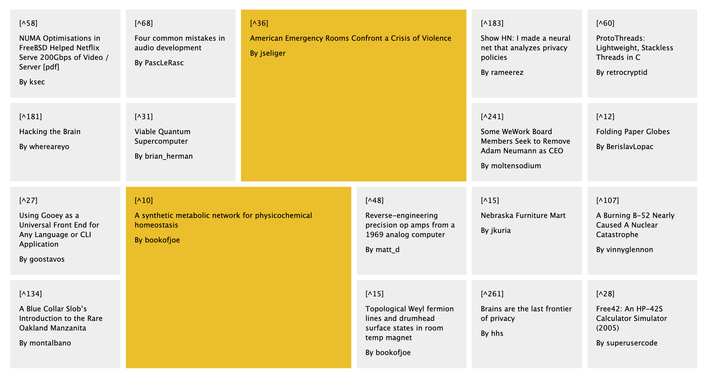

# Hacker News app

## Requirements

- Leverage Hacker News API `https://github.com/HackerNews/API`
- Clean, well structured code
- Enhanced user experience
- Examples of TDD
- HTML/CSS skills, Sass optional
- JS skills

## Installation

- `git clone ****` project locally
- `cd hacker-news` change into folder
- `npm i` to install all dependencies
- `npm run start` to start in parallel Express and Front End app
- visit `localhost:3003` to see app

## Technology used

- React
- Hooks (useState, useEffect)
- Fetch, async/await, Promise.all for collecting data
- ES6 e.g. map, filter, arrow functions, template strings
- CSS grid, Sass styling

## Comments (to be completed)

- refactor to styled-component
- fetching comments for posts
- extended fuctionality e.g. sorting by score?
- add more styles

## Screenshots

Work in progress...

