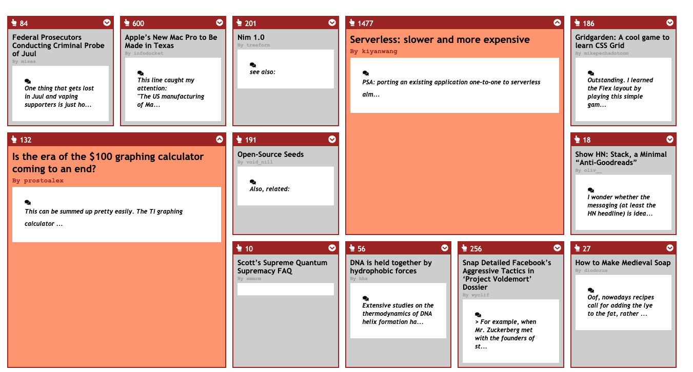

# Hacker News app

## Requirements

- Leverage Hacker News API `https://github.com/HackerNews/API`
- Clean, well structured code
- Enhanced user experience
- Examples of TDD
- HTML/CSS skills, Sass optional
- JS skills

## Installation

- `git clone ****` project locally
- `cd hacker-news` change into folder
- `npm i` to install all dependencies
- `npm run start` to start in parallel Express and Front End app
- visit `localhost:3003` to see app

## Technology used

- React
- Hooks (useState, useEffect)
- Fetch, async/await, Promise.all for collecting data
- ES6 e.g. map, filter, arrow functions, template strings
- CSS, CSS grid, BEM, Sass, Flexbox, classnames
- npm e.g. react-icons, react-loader-spinner
- Parcel.js for bundling

## Comments (to be completed)

- todo: fetching comments for posts (more than 1)
- todo: styling for extended card
- todo: comments scrolling across with arrows left/right
- todo: comments box of fixed hight, no jump when comment is loaded
- todo: comment box visible when comment loaded otherwise, hidden, maintain the space
- todo: commponent written with TDD
- fix: isExtended on Card - useContext? props.children?
- optimise: different loader for when data being fetched?
- optimise: lazyloading, optimisation, skeleton screen
- extra: extended fuctionality e.g. sorting by score?
- refactor?: data packaged by GraphQL, served by Appolo, send only relevant pieces of data
- refactor?: useReducer/Redux? - FETCH_STORIES, FETCH_COMMENT(S)

## Screenshots

Work in progress...

