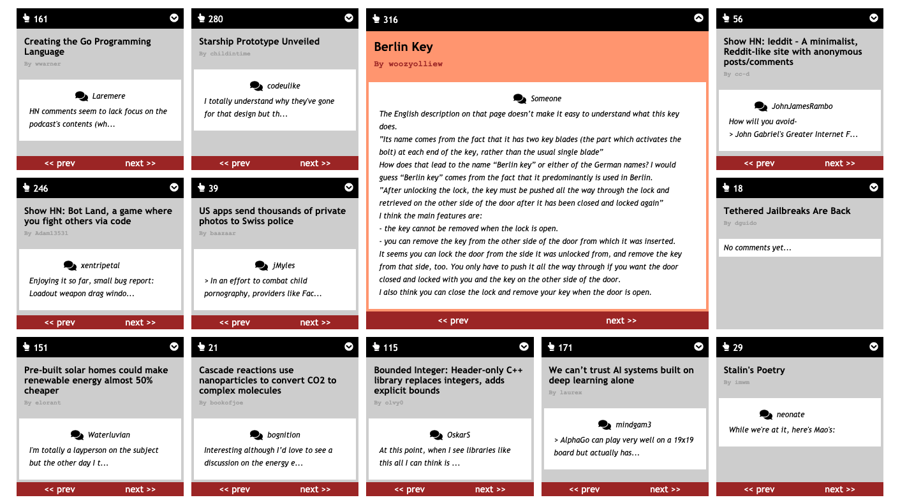

# Hacker News app

## Requirements

- Leverage Hacker News API `https://github.com/HackerNews/API`
- Clean, well structured code
- Enhanced user experience
- Examples of TDD
- HTML/CSS skills, Sass optional
- JS skills

## Installation

- `git clone ****` project locally
- `cd hacker-news` change into folder
- `npm i` to install all dependencies
- `npm run start` to start in parallel Express and Front End app
- visit `localhost:3003` to see app

## Technology used

- React
- Hooks (useState, useEffect) and custom useInfiniteScroll
- Fetch, async/await, Promise.all for collecting data
- Above refactored to axios with calls extracted to seperate services
- ES6 e.g. map, filter, arrow functions, template strings
- CSS, CSS grid, BEM, Sass, Flexbox, classnames
- npm e.g. react-icons, react-loader-spinner
- Type checking with prop-types
- Testing set up Parcel with Jest (proved to be tricky)
- First tests applied, snapshots
- Parcel.js for bundling

## Comments (to be completed)

- optimise: different loader for when data being fetched?
- optimise: lazyloading, optimisation, skeleton screen?
- optimise: refactor to styled-components, import global Sass variables via sass-extract-js, ThemeProvider?
- extra: extended fuctionality e.g. sorting by score?
- extra: data packaged by GraphQL, served by Appolo, send only relevant pieces of data?

## Screenshots

